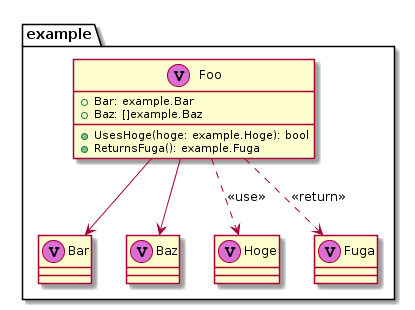

Automatically generate PlantUML from Go Code.  

example (self-reference):  


Note that the interface of this library is still ALPHA level quality.  
Breaking changes will be introduced frequently.  

## Getting Started

```sh
$ go get -u github.com/kazukousen/gouml/cmd/gouml
```

Run `gouml init` (or `gouml i`) . This will parse `.go` files and generate the plantUML file.  

### Directory-base
If you requires point to base directory, you can use `-d` flag.  

```console
$ gouml i -d path/to/package/
```

### File-base
If you requires parse one `.go` file. you can use `-f` flag.

```console
$ gouml i -f path/to/package/foo.go -f path/to/package/bar.go
```

## Usage

`gouml` handles type definitions declared in package scope as classes of UML.  
https://golang.org/ref/spec#Type_definitions

### Common

The code written by Go will convert to:

```go
package example

type Foo struct {
	Bar Bar
	Baz []Baz
}

type Bar int

type Baz string

type Hoge float64

type Fuga []byte

func (f Foo) UsesHoge(hoge Hoge) bool {
	return hoge > 0
}

func (f Foo) ReturnsFuga() Fuga {
	return Fuga([]byte("new fuga"))
}
```



### represents Enum

typed constant declarations convert to Note.  
https://golang.org/ref/spec#Constant_declarations

```go
type Number int

const (
	One   Number = 1
	Two   Number = 2
	Three Number = 2
)

// not convertable (literal)
const (
	Un   = 1
	dos  = 2
	tres = 3
)
```


