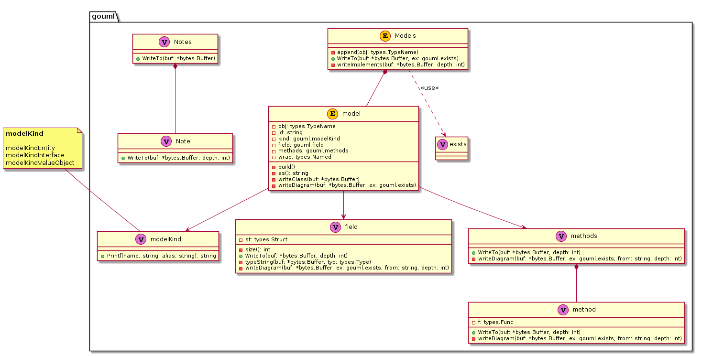

[](https://travis-ci.org/kazukousen/gouml)  

Automatically generate PlantUML from Go Code.  

example (self-reference):  


Note that the interface of this library is still ALPHA level quality.  
Breaking changes will be introduced frequently.  

## Usage

```console
$ go get -u github.com/kazukousen/gouml/cmd/gouml
$ gouml --version
```

Run `gouml init` (or `gouml i`) . This will parse `.go` files and generate the plantUML file.  

```console
$ gouml i -f /path/to/package/subpackage1/ -f /path/to/package/subpackage2/foo.go
```

Fire or Directory you want to parse, you can use `-f` flag.  

### Ignore a target directory or file

You can use `--ignore` Flag.  

```console
$ gouml i -f /path/to/package/ --ignore /path/to/package/ignorepackage/
```

## License

Copyright (c) 2019-present [Kazuki Nitta](https://github.com/kazukousen)

Licensed under [MIT License](./LICENSE)
